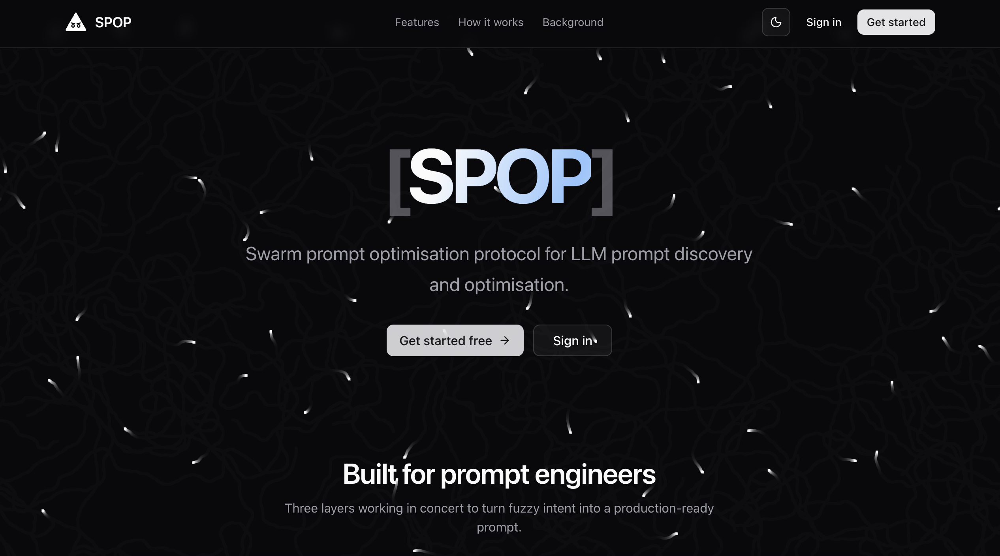

<div align="center">


# SPOP

### Swarm Prompt Optimisation Protocol

_Generate accurate prompts from context + desired output, using swarm intelligence applied to LLMs._

[**Live site → swarm-prompt-optimisation-protocol2.vercel.app**](https://swarm-prompt-optimisation-protocol2.vercel.app/)


<br/>



</div>

---

## What is SPOP?

SPOP turns prompt engineering into a **search problem**.

You give it a domain and the kind of structured output you want. SPOP then:

1. **Plans** distinct sub-topics within your domain.
2. **Generates** sample documents in parallel.
3. **Designs** an output schema (10+ fields, some nested).
4. **Drafts** a system + user prompt that reliably extracts that schema.
5. **Optimises** the prompt with a swarm — agents mutate, score and breed candidates until the prompt converges.

Inspired by ant colony optimisation, particle swarm optimisation, fish schooling, and the whale optimisation algorithm.

---

## Stack

| Layer     | Tools                                                                       |
| --------- | --------------------------------------------------------------------------- |
| Frontend  | React 19, TypeScript, Vite, Tailwind v4, shadcn/ui, React Router, Three.js  |
| Auth      | Clerk                                                                       |
| Backend   | FastAPI, Pydantic v2, psycopg 3, Alembic                                    |
| AI        | Anthropic Claude (Opus / Sonnet / Haiku), Voyage AI embeddings              |
| Maths     | NumPy, scikit-learn (PCA for swarm layouts)                                 |
| Database  | Postgres                                                                    |
| Deploy    | Vercel (static frontend + Python serverless API)                            |

---

## Images
#### Intention would be live visualisation too


#### New swarm run page


## Repo layout

```
api/index.py            Vercel Python entrypoint (re-exports the FastAPI app)
src/backend/            FastAPI application + Alembic migrations
src/frontend/           React + Vite + TypeScript app
vercel.json             Vercel deployment config
requirements.txt        Root requirements (used by @vercel/python)
```

---

## Local development

Install dev deps (includes `uvicorn`; not shipped to Vercel):

```bash
.venv/bin/pip install -r src/backend/requirements-dev.txt
```

**One-shot** — build the frontend and serve the built UI + API on `:8000`:

```bash
cd src/frontend && npm run build && cd ../.. \
  && .venv/bin/uvicorn app.main:app --app-dir src/backend --host 0.0.0.0 --port 8000
```

**Split** — backend on `:8000`, Vite on `:5173` (proxies `/api` → `:8000`):

```bash
.venv/bin/uvicorn app.main:app --reload --app-dir src/backend
```

```bash
cd src/frontend && npm run dev
```

---

## How the swarm works

The Playground runs an Ant-Colony Optimisation (ACO) loop that
*reverse-engineers* a structured-extraction prompt for the project.

### Setup

For each project, the generation pipeline already produced 10 documents
and a "gold" structured output for each. We split:

- **Training pool** — datasets `1..9` (documents + gold outputs the
  agents are allowed to see)
- **Held-out test** — dataset `10` (used only to score candidate prompts)

### One turn

Each turn fires `K` agents in parallel (`K = config.num_agents`).
For each agent `a`:

1. **Select a parent** prompt `p` from the pool of completed attempts:

   $$ P(p_i) \;=\; \begin{cases}
        \tfrac{1}{|\mathrm{pool}|} & \text{with probability } \varepsilon \\[4pt]
        \dfrac{\tau_i^{\alpha}}{\sum_j \tau_j^{\alpha}} & \text{otherwise}
      \end{cases} $$

   where $\tau_i$ is the pheromone on attempt $i$, $\alpha = 1$ is the
   pheromone exponent, and $\varepsilon = $ `config.randomness` is the
   exploration rate. On turn 1 the pool is empty and the parent is `None`.

2. **Sample** $X = 3$ training pairs $(d, g)$ uniformly at random from
   datasets 1–9.

3. **Draft** a candidate prompt $c_a$ by asking the agent LLM (model
   chosen in the run config) to reverse-engineer a system + user
   template that maps each $d$ to its $g$. If a parent was selected,
   it is shown as a seed to mutate.

4. **Execute** $c_a$ on the held-out test document $d_{10}$, producing
   a predicted output $\hat{g}_{10}$.

5. **Score** $\hat{g}_{10}$ against the gold $g_{10}$ using the
   project's JSON Schema $S$:

   $$ s_a \;=\; \mathrm{score}(\hat{g}_{10}, g_{10}, S) \;\in\; [0, 1] $$

   See *Scoring* below.

6. **Deposit** pheromone on the new attempt:

   $$ \tau_{c_a} \;=\; Q \cdot s_a, \qquad Q = \texttt{pheromone\_strength} $$

After all $K$ agents complete the turn:

7. **Evaporate** every attempt's pheromone:

   $$ \tau_i \;\leftarrow\; (1 - \rho)\,\tau_i, \qquad
      \rho \;=\; \mathrm{clamp}(1 - Q,\; 0.05,\; 0.5) $$

8. **Update best**: if $\max_a s_a > \mathrm{best\_score}$, store the new
   champion attempt and surface it in the **Best prompt** panel.

### Scoring

Given a predicted object $\hat{g}$, a gold object $g$, and the JSON
Schema $S$, the score is a required-weighted recursive average:

$$
\mathrm{score}(\hat{g}, g, S) \;=\;
\frac{\sum_{f \in \mathrm{fields}(S)} w_f \cdot \mathrm{leaf}(\hat{g}_f, g_f, S_f)}
     {\sum_{f \in \mathrm{fields}(S)} w_f}
$$

with $w_f = 1$ if $f$ is required else $0.5$, and $\mathrm{leaf}(\cdot)$
defined as:

| Schema type | $\mathrm{leaf}(\hat{x}, x)$ |
|---|---|
| `string` | $1$ if normalised exact, else Jaccard token similarity |
| `string_enum`, `boolean` | $\mathbb{1}[\hat{x} = x]$ |
| `integer`, `number` | $1$ if $\lvert \hat{x}-x \rvert/\lvert x \rvert \le 0.01$; $0.7$ if $\le 0.05$; $0.3$ if $\le 0.20$; else $0$ |
| `array` (scalars) | F1 on multiset of normalised elements |
| `array` (objects) | best-match alignment, average per-pair `score(...)` |
| `object` | recurse |
| missing required | $0$ |
| missing optional | omitted from the sum |

Scoring is deterministic and runs locally — no LLM judge in v1.

### Convergence intuition

High-scoring prompts get more pheromone and are sampled more often as
parents next turn. Mutations of those parents get scored, and good ones
in turn earn more pheromone. Evaporation prevents the pool from
collapsing to a single strain too early. The exploration rate
$\varepsilon$ keeps a steady stream of random parents in play so the
swarm can escape local maxima. In practice the **Best score** climbs
quickly, then plateaus — that's your cue to **Pause** and read off the
reverse-engineered prompt.

### Knobs (from the New Run dialog)

| Param | Symbol | Effect |
|---|---|---|
| Number of agents | $K$ | More agents → more candidates per turn (higher cost, faster convergence). |
| Randomness | $\varepsilon$ | $0$ = pure exploitation, $1$ = pure exploration. |
| Pheromone strength | $Q$ | Deposit gain. Also drives evaporation $\rho = 1 - Q$ (clamped). |
| Thought level | — | Maps to extended-thinking budget on the agent LLM call (`minimal/standard/deep/extreme` → `0 / 2k / 8k / 20k` tokens). |
| AI model | — | Which Claude model the agent uses to draft prompts. |

### Visualisation — the ant farm

To make the swarm spatial, every drafted prompt is mapped to a 2D
point. We embed the prompt text $t$ with Voyage AI:

$$ \mathbf{e} \;=\; \mathrm{embed}(t) \;\in\; \mathbb{R}^{1024} $$

then project incrementally to 2D with PCA fit on all attempts in the
run so far:

$$ (x, y) \;=\; \mathbf{W}_2\,(\mathbf{e} - \boldsymbol{\mu}),
   \qquad \mathbf{W}_2 \in \mathbb{R}^{2 \times 1024} $$

PCA is deterministic — new attempts land in coords consistent with the
existing layout, so the map stays visually stable as the run
progresses. Every $L = 5$ turns the layout can optionally be re-fit
with t-SNE for crisper clusters and the frontend animates dots to
their new positions.

If `VOYAGE_API_KEY` is unset the layout falls back to a deterministic
local hash-trick embedding — clusters are coarser but the visualisation
still works without any extra API key.

On the map:

- **dot position** = $(x, y)$
- **dot radius** $\propto \tau$ (pheromone)
- **dot colour** = HSL from red ($s=0$) through yellow ($s=0.5$) to
  green ($s=1$) — `hsl(120·s, 70%, 50%)`
- **trail opacity** $= s$ (faint for poor children, vivid for good ones)
- **ant** = the live agent ticker beneath the map shows each agent's
  status (`drafting → scoring → done`); the resulting attempt lands as
  a new dot when the score arrives

As the swarm runs you should see clusters of green dots forming around
high-scoring strains, with thinning trails between them — the colony's
collective memory of which prompt regions were worth exploring.

---

## Deploy to Vercel

```bash
npm i -g vercel
vercel
```

The `vercel.json` builds the frontend into `src/frontend/dist`, deploys `api/index.py` as a Python serverless function, and rewrites `/api/*` to it.

---

## Future updates

- [ ] AI model variation across a single run (mix Opus/Sonnet/Haiku agents in the same swarm).
- [ ] Custom context uploads and user-supplied desired outputs.
- [ ] More natural algorithms implemented (PSO, fish schooling, whale optimisation alongside ACO).
- [ ] Creation of runs with voice alone.

---

<div align="center">
<sub>Built with swarms 🐝</sub>
</div>
